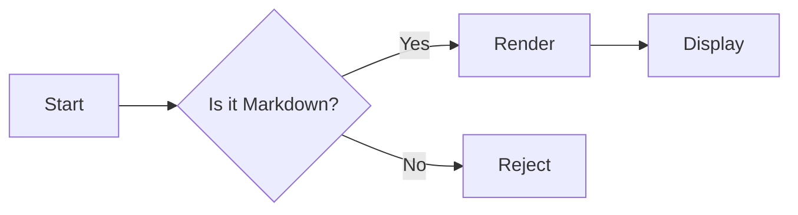

# MDReader Test Sample

This file exercises every renderer feature so we can scan for regressions in one shot.

## Headings

# H1
## H2
### H3
#### H4

## Inline marks

**bold** · *italic* · ~~strike~~ · `inline code` · [link](https://github.com)

## Lists

- Bullet 1
  - Nested
- Bullet 2

1. First
2. Second
3. Third

### Task list (GFM)

- [x] Buy groceries
- [ ] Walk the dog
- [ ] Read book

## Tables (GFM)

| Feature       | Status | Notes                |
| ------------- | ------ | -------------------- |
| Code highlight | ✅     | highlight.js         |
| Mermaid       | ✅     | Lazy-loaded          |
| KaTeX         | ✅     | Inline + display     |
| Tables        | ✅     | GFM                  |

## Quotes

> The best way to predict the future is to invent it.
> — Alan Kay

## Code block

```python
def fib(n: int) -> int:
    if n < 2:
        return n
    return fib(n - 1) + fib(n - 2)

print([fib(i) for i in range(10)])
```

```swift
import SwiftUI

@main
struct Hello: App {
    var body: some Scene {
        WindowGroup { Text("Hi") }
    }
}
```

## Math (KaTeX)

Inline: $E = mc^2$ and $a^2 + b^2 = c^2$.

Display:

$$
\int_{0}^{1} x^2 \, dx = \frac{1}{3}
$$

## Mermaid



## Horizontal rule

---

End of sample.
